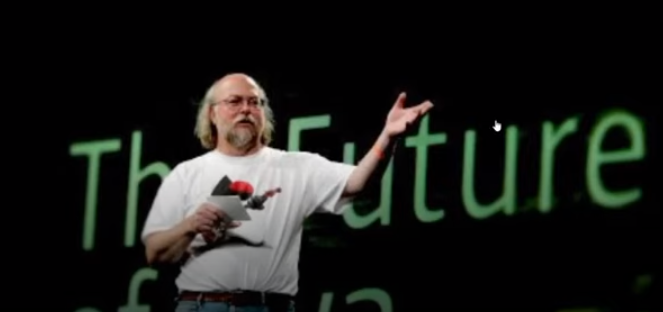
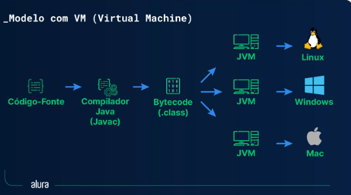

# Objetivo 

Estrutura, história Fundamentos Básicos.

# História
Java é uma Linguagem composta por conjunto em definido de funcionalidades (features) que são
recomendadas para que os entusiastas em programação possam conhecer o máximo que puder.
O objetivo é simplicidade era o objetivo dos povos JavaSoft, porque tem que funcionar em dispositivos em que se tem pouco recurso de memória

A Linguagem Java é Orientada a Objetos. Isso signifíca que temos que criar Classes e Objetos
Plataforma é o ambiente de hardware e softare no qual o programa é executado.

Em Java o código fonte é compilado para bytecode e esse bytecode não está vinculado a nenhuma plataforma. Ele pode ser executado em qualquer dispositivo.

# O conceito de WORA ( Write Once Run Anywhere) o recurso independendente de plataforma tornana o Java.

# Portátil.
Podemos então dizer que podemos obter os mesmos resultados com o mesmo código para qualquer máquina. Compatibilidade entre hardwares ou plataformas, por conta da JVM e bytecode

# Robusta
É capaz de lidar com o enceramento inesperado de um programa 
Gerenciamento de memória forte.
Fornece coleta de lixo automática
Há tratamento de exceção

# SEGURA

Java verifica e faz pré análize de violação em nossos códigos.
Recursos de criptografia e decriptografia para proteger os dados contra espionagem.

# Compilada ou Interpretada

A Linguagem Java utiliza compilador gerando bytecodes que por sua vez são interpretados pela JVM.
Compilação é uma coversão de uma estrutura para outro para que possa traduzir.

# Thread 
(Linha de execução) É uma sequência de instruções que faz parte de um processo principal

# Multi-thread

É a execução de várias threads em massa em um mesmo processo.

# História 

A Sun Microsystem financiou em 1991 uma pesquisa interna com o codinome Green. 
O projeto resultou  no desenvolvimento de uma linguagem baseada em C e C++ que
seu criador, James Gosling, chamou de OaK(carvalho) em homenagem a uma árvore 
que dava para a janela do seu escritório na Sun.

 

# James Gosling

Quando a equipe da Sun visitou uma cafeteria local, o nome Java (cidade de origem de um tipo de café importado) foi sugerido e pegou
O projeto atravessava dificuldades com o mercado para dispositivos eletrônicos.
Quando a World Wide Web explodiu em popularidade em 1993 o pessoal da Sun viram o imediato potencial de utilizar Java para criar páginas da Web com o chamado conteúdo dinâmico. Isso revitalizou o projeto e em maio de 1995 a Sun anunciou formalmente em uma conferência. Java gerou interesse imediato nas comunidades comerciais.

# Java é agora utilizada praticamente em todo lugar
-Páginas Web com conteúdo interativo e dinâmico
-Aplicações corporativas de grande porte
-Softwares destinados ao consumidor final
-Aplicativos para Smartphones

# 25 Anos de existencia cada vez mais features

# Caracteristicas das versões com grande impacto

J2SE 5.0 30 setembro de 2004 Introduão dos Generics, Enumerações, Autoboxing, for-eac entre outros.

JSE 8.0 18 marcço de 2014 Exoressões Lambdas, foreach, Consumer, Interfaces, methods, methods references

JSE 11 25 setembro de 2018 Escrever strings em arquivos readString()
writeString() e outros métodos foram adicionados

# Escolha sua IDE Integrated Development Environment ou Ambiente de Desenvolimento
Aumentam a produtividade, aceleração de escrita com auto-complete ou intelliSense(expressões que implementam até um bloco de código)
Letras coloridas, melhor visibilidade análise de erro de sintaxe, compilação de programa
Depuração (acompanhamento) de execução do programa

Cada IDE dispõe de recursos comuns ou plugins específicos para auxiliar na agilidade

VsCode
NetBeans
Eclipse 
IntelliJIDEA --> Poderosa, porem tem plugins pagos

# Configuração do ambiente

Necessário JDK instalado
Determinar a versão do Java diante dos requisitos do projeto

Baixar o JDK[VERSÃO] pesquisar e baixar o .exe
Criar uma conta no site da Oracle
JSE 

next --> next 

Extensão para desenvolver com Java
vscode for Java -> Google 
BAIXAR VsCode development Java


ctrl+shift+p No VsCode para criar um programa java ou para configurar tamanho de letras etc...

Instalando Várias IDES
Integrando VsCode com git

# Criar repositório no GitHub

Conectar a conta no git com VsCode entrar configura sync
ctrl+shift+p git clone

# Resumo 

O compilador --> código fonte e converte --> código binário



O Compilador converte um arquivo de extensão (.class) em (bytecode)

co bytecode

O javac (java compilador gera arquivos.class)
O arquivo .class contém o bytecode

javac [nomearquivo].extensão
gera um arquivo .class
java [nomeArquivo] 

# Objetivo do curso
Apresentar regras para desenvolver
Pré-requisitos
JDK
IDE 
DIRETÓRIO DO PROJETO

# Anatômia da Classe
Características
Criamos um arquivo.java
Utilizar nomenclatura coerente com o objetivo
Preferêncialmente escrever em inglês


```
  public class MinhaClass {
    //seu código

  }

```

Estrutura inicial
Padrão de Nomenclatura
Declaração de variáveis
Identação
Organização de arquivos
Java Beans


Funcionalidades

# Recursos
# Configurar ambiente
# Definir uma IDE e aumentar a produtividade
