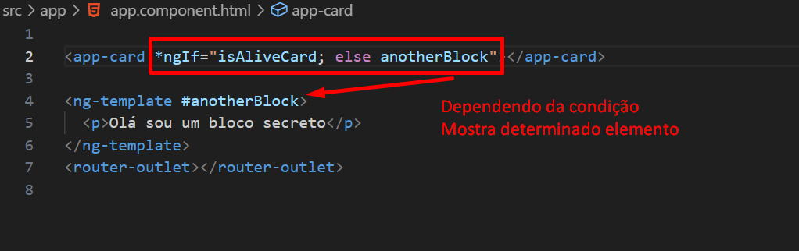
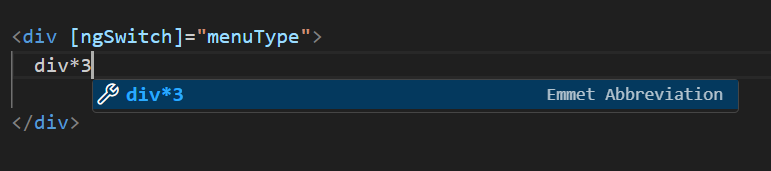
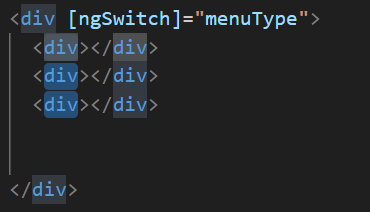

# Diretivas no Angular

Criamos um projeto ng new diretivas-proj

# ng g c card

# A propriedade \*ngIf="true" || "false" do Angular

Serve para mostrar ou não ume elemento e ou componente

```
<h1>My-App</h1>
<p *ngIf="false">card works!</p>
<button> Olá Mundo </button>

```



<h1>My-App</h1>
<p *ngIf="true">card works!</p>
<button> Olá Mundo </button>
<ul>
  <li *ngFor="let p of produtos">{{p}}</li>
</ul>

```
import { Component, OnInit } from '@angular/core';

@Component({
  selector: 'app-card',
  templateUrl: './card.component.html',
  styleUrls: ['./card.component.css']
})
export class CardComponent implements OnInit {
  produtos:string[] = []
  constructor(){
    this.produtos = [
      "mouse",
      "teclado",
      "cabo",
      "fonte"
    ]
  }
  ngOnInit(): void {
    throw new Error('Method not implemented.');
  }
}

```

<h1>My-App</h1>
<p *ngIf="true">card works!</p>
<button> Olá Mundo </button>
<ul>
  <li *ngFor="let p of produtos">{{p}}</li>
  <button (click) ="adicionar()">Adicionar</button>
</ul>

Reatividade -> muda o estado de quem está conectado.

# Criando um menu específico para determinado usuário.

Criamos um ngSwitch dentro de uma div

e dentro da div criamos três div(s)

Util: div\*3 cria três divs



Ctrl + Alt + Shift com o cursor sobre elementos e ceta para baixo seleciona várias elementos de uma vez.



O Switch permite construir partes dinâmicas na tela

- Switch case -> criar blocos condicionais do html
  [ngSwitch]="menuType"

# Diretivas de Atributos

Imageine que temos duas classes

<h1 [ngStyle]="{'background':corFundo, 'color':corDaFonte}">CURSO DE ANGULAR</h1>

O ngStyle permite estilizar uma parte da aplicação fazendu um bind para alterar os valores criando variáveis em nosso .ts

# NgModel

Faze a conexão do html com typescript e typecript com html
[()] --> anotação caixinha de banana

O ngModel não vem como padrão

Ir no app.module.ts ou onde estamos agrupando nossos componentes e importar
import {FormsModule}
Este modulo permite trabalhar com forms

<!--[(ngModel)]="item" binding bi-direcional-->

# NgTemplate

```
<hr />

<ng-template [ngIf]="isEnableBlock">
  <a href="#">Finalizar Compra</a>
</ng-template>
<br>
<ng-template [ngIf]="isEnableBlock">
  <a href="#">Adicionar ao Carrinho</a>
</ng-template>

<hr />
```

É um bloco ou container que existe na view mas por padrão vem desabilitado é preciso atribuir um "true" para exibir

# NgContent
<ng-content></ng-content> permite pegar conteudo que está passando dinâmicamente para meu componente 

<app-comp-atributos>
  <h2>Olá</h2>
  <p>eu vim de fora</p>
</app-comp-atributos>

<ng-content select="h2"></ng-content> //renderiza o conteúdo passado nas tags pai
 
 # conclusão

 aprendemos trabalhar com ngModel
 ngStyle
