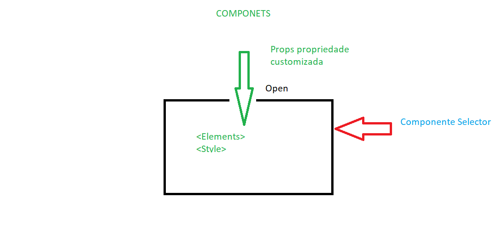

# Medo de frameworks 
Felipe Aguiar 05/09 
# Pré Requisitos
- HTML, CSS e JavaScript(Linguagem Interpretada)
- VsCode -> extensões
- Node.js Runtime interpretador .js junto com ele vem npm(gerenciador de pacotes)

# Por que precisar de web components

ex: 
[medium.com]("http://medium.com")

inspecionando o código  de uma noticia é possível notar que existem vários elementos html(s)

div, span, p, h1, image

Para construir um bloco temos um conjunto de elementos ou tags html(s)

# Imagine se pudessemos criar uma só tag chamada notícias
Instalar exetensão Live Server

Box shadow elemento de sombra em volta da caixa
[CSS Generator](https://webcode.tools/generators/css/box-shadow)

# Próximo passo 

tldraw -> extensão no vscode para desenhar
new file file.tldr


Elemento HTML -> Navegador -> parsed -> dom

DOM -> ramificado em arvore

# Shadow Dom ( parra não cair no lado obscuro da força SADOW DOM aprender você deve - Yoda)

Complexidade no código renderizando vários elementos DOM

Shadow Dom - > permite você criar uma árvore/subarvore --> Shadow Dom (Dom fantasma) podemos trabalhar desacoplado e encapsulado. 
-> consumir de forma simples
-> custom element (customizado) criaremos uma tag html que acessa custom elment isola e componentiza os componentes
1 -> elment torna se um component
[Can I use] (https://caniuse.com/)

Componentes são funções js que acaba retornando + javascript, html e css
```
//Componentes são funções js que acaba retornando + javascript, html e css
class CardNews extends HTMLElement{
    constructor(){
        super(); //Invoca o método construtor de quem está herdando

                             //anexa uma sombra 
                             //fantasma        //closed o mundo exterior não pode modificala
                                               //open pode ser modificado pelo mundo externo
        const shadow = this.attachShadow({mode:"open"})  //A classe que foi chamada em super()
        shadow.innerHTML = "<h1>Hellow José</h1>" //cria um selector tag card-news
    }
   
}
customElements.define('card-news', CardNews) //definindo que vai ser utilizado através do seletor card-news

```

<script src="src/components/CardNews.js" defer></script> -> esse elemento booleano faz com que este script seja executado depois que o navegado carrega a DOM

Incrementando mais nosso componente
Arquitetura do componente 

Estrutura html componentes(tratados fora do html) -> componente caixa container (open) onde pondemos vários elmentos html ex: div, p, e a cada um desses é um element 
Componente é um conjunto de elementos encapsulados
Os componentes podem conter estilos exclusivos

Components tem -> Html, CSS, JavaScript e podem ser dinâmicos (criando um Prop (propriedade customizada) exemplo passando um name no h1 )
Permite reaproveitar códigos criar bibliotecas próprias trabalhar focado em determinadas partes e criar padrões

Props -> propriedades dinâmicas entram pela abertura passada no "open"


Components são scoped aplicando alterações somente nos componentes (independentes)

# Criando um Component

```
class TituloDinamico extends HTMLElement {
    constructor(){
        super();
        const shadow = this.attachShadow({mode:"open"})

        //Base do componente
        const componentRoot = document.createElement('h1');
        componentRoot.textContent = this.getAttribute("titulo") //cria uma propriedade para a tag

        //Estilizar o componente

        const style = document.createElement("style")
                             //template string ``
        style.textContent = `
           h1{
            color:red;
           }
        
        ` 

        //Enviar para a shadow
        //anexando à árvore fantasma shadow
        shadow.appendChild(componentRoot)
        shadow.appendChild(style)
    }
}                            //o hifém é required
customElements.define('titulo-dinamico', TituloDinamico)
```

Recriando o card-news

# Esqueleto de um component

```
class CardNews extends HTMLElement{
    constructor(){
        super();
      
    }

    build(){
        
    }

    styles(){}
}
customElements.define("card-new",CardNews)
```

