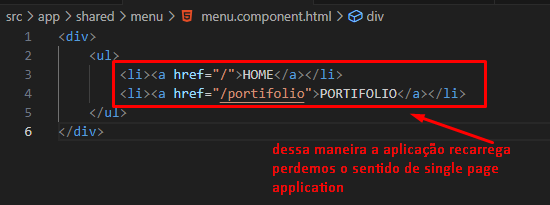
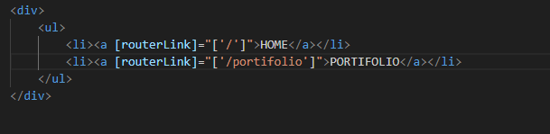
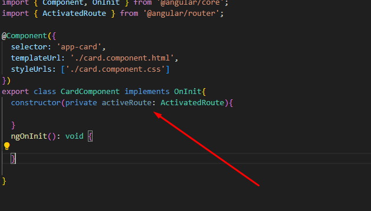

# Rotas

ng g m pages/index //criamos  um módulo pages com o arquivo index


ng g m pages/portifolio 

ng g c pages/index/title

ng g c pages/portifolio/card


# Export do componente no arquivo index.module.ts 

```

@NgModule({
  declarations: [
    TitleComponent
  ],
  imports: [
    CommonModule
  ],
  exports: [ adicionamos essa linha
    TitleComponent
  ]
})
export class IndexModule { }
```
# Export no CardComponent

```
import { NgModule } from '@angular/core';
import { CommonModule } from '@angular/common';
import { CardComponent } from './card/card.component';


@NgModule({
  declarations: [
    CardComponent
  ],
  imports: [
    CommonModule
  ],
  exports: [ --> adicionamos essa linha
    CardComponent
  ]
})
export class PortifolioModule { }

```

# Entendendo as Rotas.

# Configurando Objetos de Rotas


const routes: Routes = [
  {
    path:'',component:TitleComponent, pathMatch:'full' 
  },
  {
    path:'portifolio',component: CardComponent, pathMatch:'prefix'
  }

];

# pathMatch -- full  --> Quando quero a url exata

# pathMatch-- prefix --> Quando quero que a url contenha a url que pode ser alterada.


const routes: Routes = [
  {
    path:'',component:TitleComponent, pathMatch:'full'  //quando não tem nada geralmente utilizada 
    // rotas principais para evitar conflitos de rotas.
  },
  {
    path:'portifolio',component: CardComponent, pathMatch:'prefix' //quando existe um caminho de pastas na url

  }

];

# Rotas Coringa


const routes: Routes = [
  {
    path:'',component:TitleComponent, pathMatch:'full'  //quando não tem nada geralmente utilizada 
    // rotas principais para evitar conflitos de rotas.
  },
  {
    path:'portifolio',component: CardComponent, pathMatch:'prefix' //quando existe um caminho de pastas na url

  }

];

# Imaginando que temos um menu onde existe uma opção de link que redireciona para outra página:
//Como vai ser compartilhado em vários outros locais do sistema colocamos a past shared
ng g c shared/menu



A imagem abaixo mostra a melhor maneira de criar os links em angular, melhorando a performance



# Rotas com parametros



# Query Params

http://localhost:4200/portifolio/1?name=jose&token=123

# Redirecionamento por componentes

